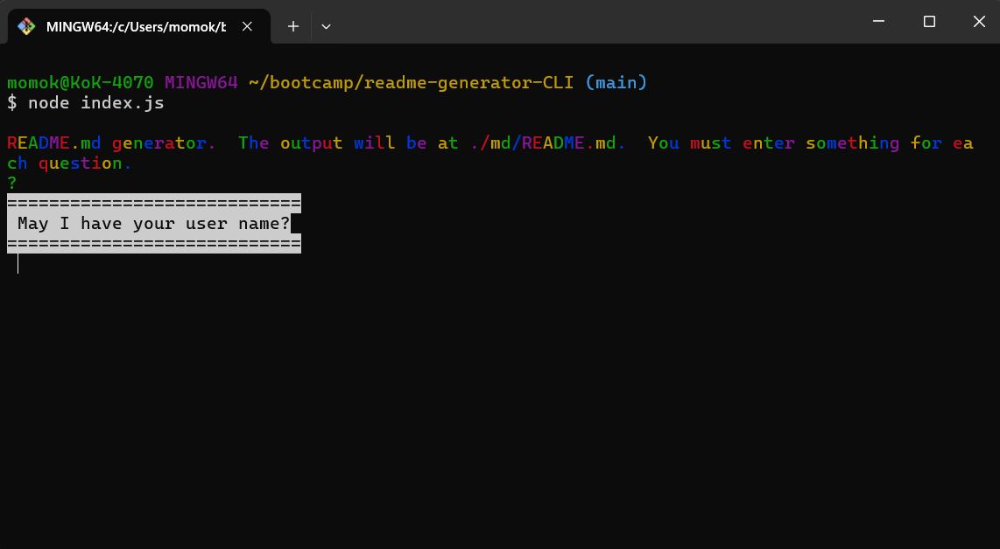
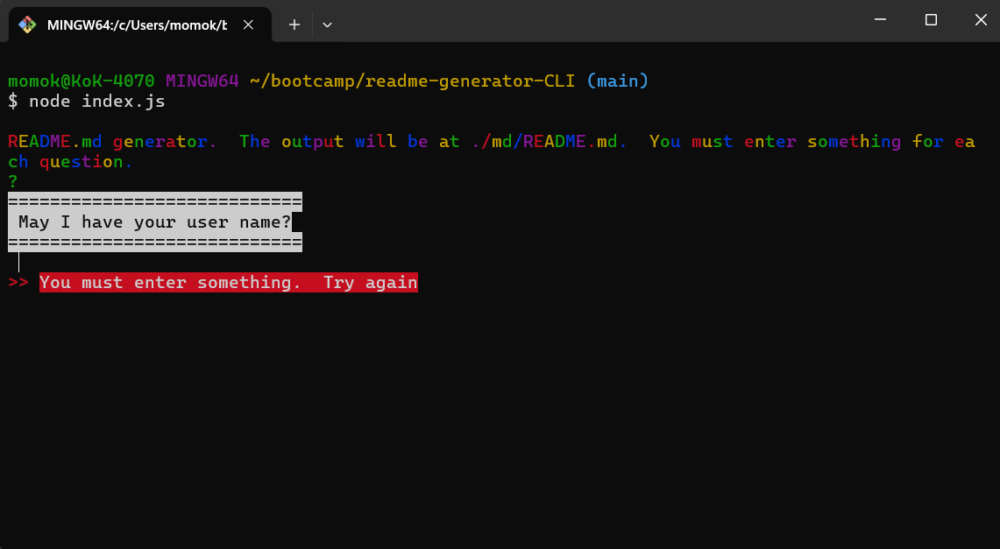
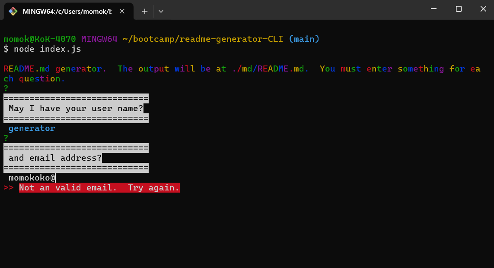
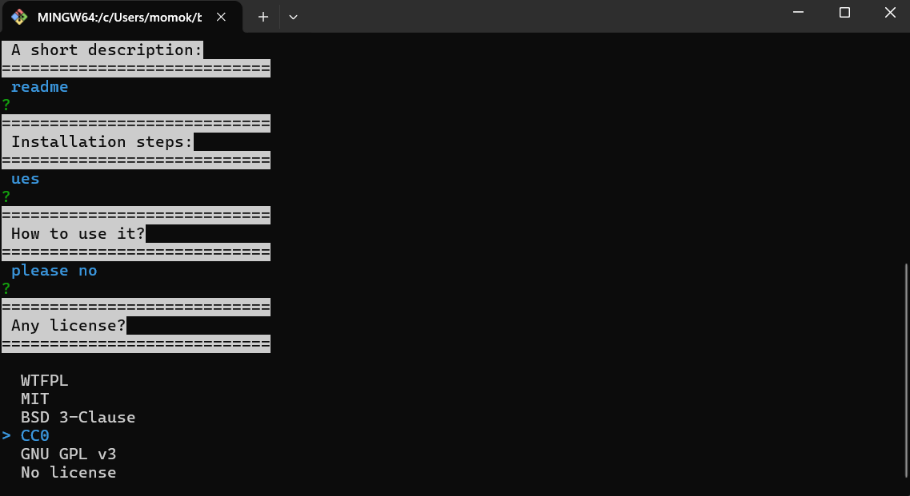
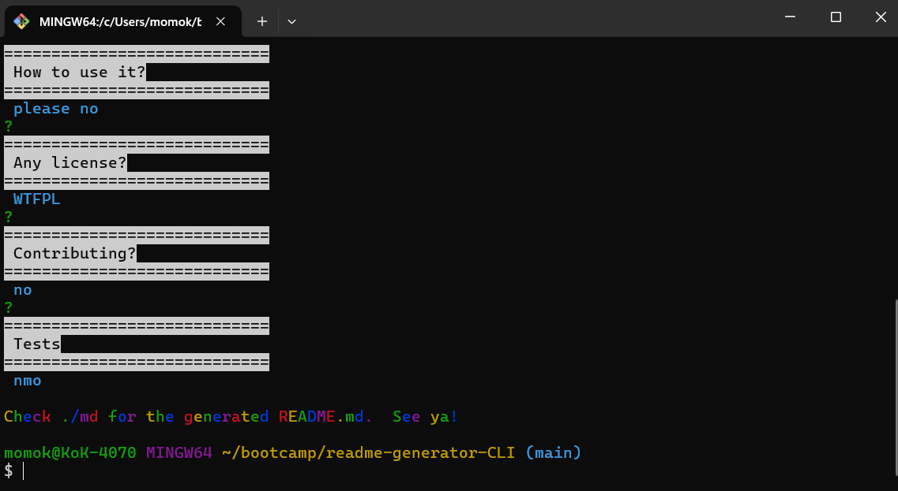

# readme-generator-CLI

## Table of content
- readme-generator-CLI
  - [Description](#Description)
  - [Installation](#Installation)
  - [Usage](#Usage)
  - [Screenshot](#Screenshot)
  - [Contributing](#Contributing)
  - [License](#License)
  - [Questions](#Questions)

## Description
This is a README generator that quickly create a README.md for a new project. 

## Installation
- The generator requires npm.  [See Node.js installation.](https://docs.npmjs.com/downloading-and-installing-node-js-and-npm)
1. Clone the repo: https://github.com/momokokong/readme-generator-CLI
2. In the terminal, move to where the cloned local repo is.
3. `npm install`
   - If it does not automatically install the required module, follow below instructions:
     - `npm i colors`
     - `npm i validator`
     - `npm i inquirer@8.2.4`
4. Ready to use after the modules are installed

## Usage
node index.js
1. Once the modules are installed, start the generator by `node index.js`.
2. Follow the on-screen instructions.
   - It validate user inputs.  All questions must be answered with non-empty answer or valid email format.
3. The output README.md will be in the folder md/.

## Screenshot
Starting the generator:  

Should not have empty entry:  

Require valid email entry:  

Questions required for README.md:  

The end:  

## Contributing
Contact me.  Find my information in the [Questions](#Questions) section.

## License
This project adopts WTFPL license practices. Check the website for license details: [License: WTFPL](http://www.wtfpl.net/about/)

## Questions
[momokokong's GitHub profile.](https://github.com/momokokong)

[Po Shin Huang Linkedin profile](https://www.linkedin.com/in/poshinhuang/)